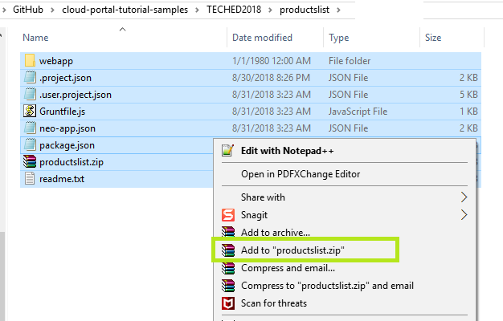

### Download and Installation
To use one of the included SAPUI5 project resources:
1. Clone the repository or download it to your file system.
2. Navigate **into** the desired `resource-name` folder (for example: apps/`productlist`/..)
3. Create a ZIP file from all of the underlying files:
	* Select all of the included files (Ctrl^A)
	* Right click and select 'Add to `resource-name`.zip (for example: `productlist.zip`)

	.

4. Import the ZIP file into your SAP Web IDE
	* In the SAP Web IDE, right click on the **Workspace** folder and select Import > File or Project

	.

	*  In the Import dialog browse and select the resource ZIP file you created.

	.

5. Once the Import is complete, a new project folder is created in the SAP Web IDE. TO make it available in the Portal, deploy it to the SAP Cloud Platform.
	.
