# SAP Cloud Platform Portal with Contentstack Integration

## Leverage Contentstack to Create and Manage Web Content in your Portal

#### Introduction
In this guide we will build an SAP Cloud Platform Portal site that uses content snippets created and managed on Contentstack. You will learn how to first set up a stack and content types and create entries in Contentstack, then to set up a portal site which uses custom developed widgets that link to certain content types and pull the content from the Contentstack server into the portal page at runtime.
The portal site in this example consists of one page that  contains three blocks of content:
* A **hero** block (“Revitalize Your SAP User Experience …”),
* A **feature** block with two sub-blocks (“Build a Modern, …” and “Be a User …”), and
* A block of **grouped links** (“Resources”).

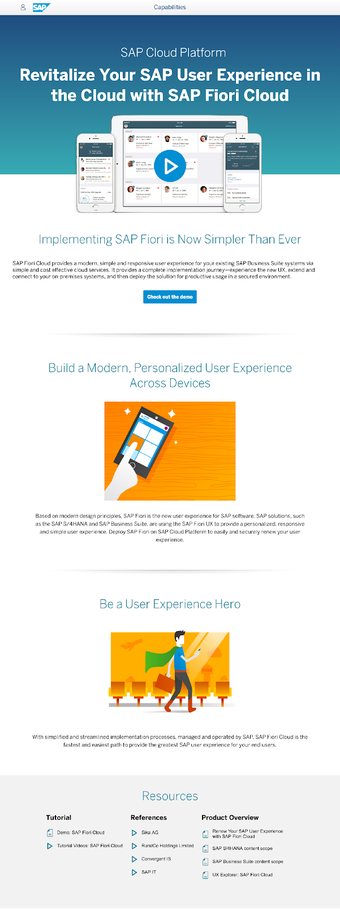

You will achieve this result in eight steps that are laid out and described in the following chapters:
* Step 0: Prerequisites
* Step 1: Create a New Stack
* Step 2: Set Up Content Types
* Step 3: Create an Environment
* Step 4: Create Entries
* Step 5: Deploy Contentstack Proxy Application
* Step 6: Create Destinations for Proxy and Backend
* Step 7: Develop Widgets in Web IDE
* Step 8: Set up a Portal Site

Let’s start!

#### Step 0: Prerequisites

Before you start working with this document make sure you have the following prerequisites in place.

###### 1. Register and login to an SAP Cloud Platform Trial (NEO) Account
This How-to-guide can be performed on any SAP Cloud Platform (NEO) account – so if you already have a productive (NEO) account on anyone of the SAP data centers, or have already registered to a [free trial account](https://account.hanatrial.ondemand.com/) – login to that account.

Otherwise, you can register for a free SAP Cloud Platform account and access your NEO Platform account cockpit. Follow the instruction here: [Sign up for a free trial account on SAP Cloud Platform](https://www.sap.com/developer/tutorials/hcp-create-trial-account.html).

###### 2. Register and login to a Contentstack Account
If you already have a Contentstack account, go ahead and use that account. Otherwise register here for a [free trial account](https://www.contentstack.com/company/contact-us?subject=free%20trial)

###### 3. Setup Tools for Java Development on the SAP Cloud Platform Neo Environment
1. Navigate to [SAP Development Tools > Cloud](https://tools.hana.ondemand.com/#cloud)
2. Follow the instructions under `Getting Started with SAP Cloud Platform Neo Environment`. When downloading the `SAP Cloud Platform Neo Environment SDK` select **Java EE 6 Web Profile**

#### Step 1: Create a New Stack on Contentstack
In order to create a portal site that uses content created and managed with Contentstack, we need to create a new stack in Contentstack. A stack is a pool of data or a container that holds all the content and assets related to a site.

- In your browser, go to the website https://app.contentstack.com/#!/login and log in with your credentials.
- Press **New Stack**, give your new stack a meaningful name and (optionally) a description.
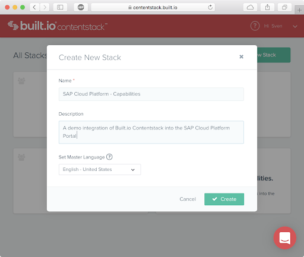
- You _may_ also assign a master language for the stack. To learn more about languages in Contentstack read - [Localization](https://www.contentstack.com/docs/guide/localization#how-languages-work).
- Press **Create**. The new stack will open and ask you to create content types.
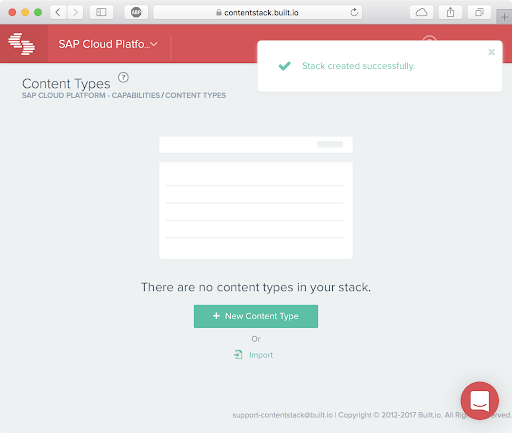

#### Step 2: Set Up Content Types
Now lets create a number of content types for our site. A content type lets you define the structure or blueprint of a page or a section in a page. To learn more about content types, please [read here](https://www.contentstack.com/docs/guide/content-types).
For our site we need to determine what kind of content we need, how it should be structured, and then define the required content types and fields - see [Content Modeling](https://www.contentstack.com/docs/knowledgebase/content-modeling).

As already mentioned above, our page will contain three different kinds of content types: “Hero”, “Feature”, and “Grouped Links”.

Let’s start setting up the first content type:
- Press `New Content Type`.
- Select `Content Block` – we are defining a (potentially reusable) content block instead of a whole web page (see [Content Types](https://www.contentstack.com/docs/guide/content-types#types-%E2%80%93-webpage-and-content-block) ).
- Enter the name `Hero`. This will automatically set the Unique ID to `hero`.
- Make sure that `Single` is selected – our page contains only one hero block, and there is no need to create additional ones (see [Single vs Multiple](https://www.contentstack.com/docs/guide/content-types#single-vs-multiple)).
- Optionally add a description.
- Press `Create and Add fields`.

Now we add fields of different type to the newly created content type. One field, `Title`, is mandatory, and already placed on top of the new content type. One by one we add the following fields via drag and drop from the right panel:
- A **SINGLE LINE TEXTBOX** with display name `Headline` and unique ID `headline`
- A **LINK** with display name `Video URL` and unique ID `video_url`
- A **FILE** with display name `Video Image` and unique ID `video_image`
- A **SINGLE LINE TEXTBOX** with display name `Intro Header` and unique ID `intro_header`
- A **MULTI LINE TEXTBOX** with display name `Intro Text` and unique ID `intro_text`
- A **LINK** with display name `Call-to-Action` and unique ID `call_to_action`.

A field’s display name, unique ID, placeholder value, instruction value, help text, default value, etc. can be changed/edited by clicking on the respective field which opens a flyout with the available attributes.

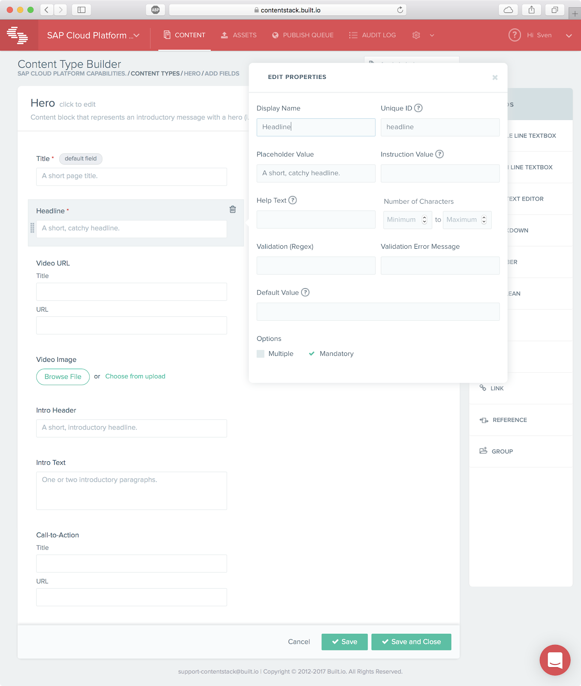
- After having added all necessary fields, press `Save and Close`.
- Result: A new content type **Hero** is shown in the list.

Repeat the steps for the next content type **Feature** using the following information:
- As metadata
  - Select `Content Block`
  - Enter the name `Feature`
  - Select `Multiple` (allow multiple entries…) and optionally enter a description.
- Add the following fields (in addition to the already existing **Title** field):
  - A **FILE** with display name `Image` and unique ID `image`
  - A **MULTI LINE TEXTBOX** with display name `Details` and unique ID `details`
  - A **NUMBER** with display name `Sort Priority`, unique ID `sort_priority`, a range from 0 to 100, a default value of 50, and marked as “Mandatory”. This field is later used by the widget to determine in which order multiple features appear on the page.

Finally we need two content types at once for the last component **Grouped Links**. One that serves as the container of the three link groups **Tutorial**, **References** and **Product Overview** and one for the icon-prefixed links itself.
This component could actually be realized with one single content type using a(n outer) group of (link) groups, but here we assume for demo purposes that the links are reusable (e.g. on other pages) and thus we want to reference single link entries in the outer group.

So, firstly create a content type for the icon links:
- As meta data:
  - Select `Content Block`
  - Enter the name `Icon Link`
  - Select `Multiple` and optionally enter a description.

- Add the following fields (in addition to “Title”):
  - A **SINGLE LINE TEXTBOX** with display name `Icon` and unique ID `icon`, marked as `Mandatory`,
  - A **SINGLE LINE TEXTBOX** with display name `URL` and unique ID `url`, marked as `Mandatory`,
  - A **SINGLE LINE TEXTBOX** with display name `Target`, unique ID `target`, validation regex `^(_self|_blank)$`, validation error message `Can only be "_self" or "_blank".`, default value `_self`, and marked as `Mandatory`.

Lastly create a content type for the component containing the groups of links:
- As meta data:
  - Select `Content Block`
  - Enter the name `Grouped Links`
  - Select `Multiple` and optionally enter a description.
- Add the following field (in addition to `Title`):
  - A **GROUP**  with display name `Link Group`, unique ID `link_group`, and marked as `Multiple`. This field in turn needs two nested fields:
  - A **SINGLE LINE TEXTBOX** with display name `Title`, unique ID `title`, marked as `Mandatory`, and with `Mark as Group title` checked.
  - A **REFERENCE** with display name `Links`, unique ID `links`, marked as `Multiple`, and with selected content type `Icon Link`.

Now you are almost ready to create the actual content. But before that we need to define the environment that content should be published to.

#### Step 3: Create an Environment
A publishing environment corresponds to one or more deployment servers or a content delivery destination where the entries (i.e. the content pieces) need to be published. The most common publishing environments used are development, staging, and production. In this Cloud Portal demo integration scenario though we can simplify things: we only need one environment, say **production**, without a base URL and no need to deploy content to servers. The latter will be taken care of by leveraging Contentstack's REST-API and pulling the content from the server.

- In the header menu choose `Settings > Environment`
- Press `New Environment`
- Enter the name **production”**
- Leave `Base URL` blank and keep `Deploy Content to Server(s)` unchecked
- Press `Add`.

#### Step 4: Create Entries
With the three content types in place and an environment defined, you can now fill the stack with life, i.e. you create one or multiple entries for each content type. An entry is the actual piece of content that you wish to publish. If you think in an ‘object-oriented’ way an entry could also be described as the instance (=object) of a constant type (=class).
- In the header menu choose `Content`
- In the list of content types, click on the content type for which you wish to create an entry (or multiple entries).

###### Create _Hero_ entries

Lets start with creating an entry for **Hero**. In the case of “Hero” you will directly be prompted with the data entry, since the content type is marked as “Single”.
- Click on the `Hero` content type
- Fill in the fields:
  - `Title` = SAP Cloud Platform
  - `Headline` = Revitalize Your SAP User Experience in the Cloud  with SAP Fiori Cloud
  - `Video URL / Title` = Watch this video to learn more about the product.
  - `Video URL / URL` = https://www.youtube.com/watch?v=v6tOQlBTAY4
  - `Video Image` = Select the image provided in this repository: "/Contentstack Integration/resources/images/Fiori_iOS.png"
  - `Intro Header` = Implementing SAP Fiori is Now Simpler Than Ever
  - `Intro Text` = SAP Fiori Cloud provides a modern, simple and responsive user experience for your existing SAP Business Suite systems via simple and cost effective cloud services. It provides a complete implementation journey—experience the new UX, extend and connect to your on-premises systems, and then deploy the solution for productive usage in a secured environment.
  - `Call-to-Action`  
    - `Title` = Check out the demo
    - `URL` = http://www.sap.com/fiori-demo

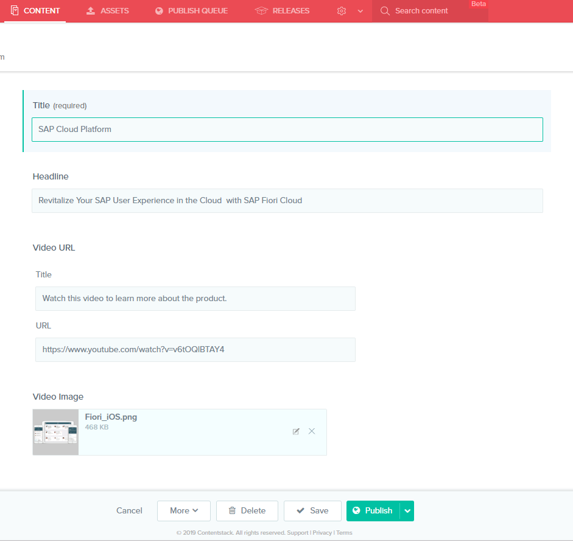

- Click on `Publish` to make the instance available
- Select the `production` environment, check publish `Now` and click `Publish`
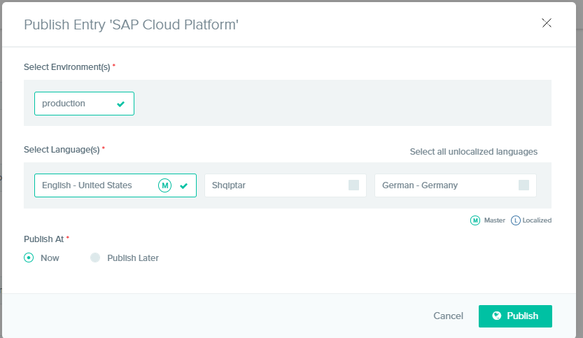

In the other three cases (`Feature`, `Icon Link`, and `Grouped Links`, all marked as `Multiple`) you will first be taken to a list where you – one by one – create and fill new entries.

###### Create _Feature_ entries

- Click on `Feature`
- Click on `+ New Entry` to create a new entry
- Create 4 entries with the following values

Title | Image | Details | Sort Priority
------------ | ------------- | ------------- | -------------
Pricing and Packaging | /resources/images/pricing.jpg | Your business is unique, so SAP Cloud Platform is available in a variety of packages—each designed to equip you with the tools you need.| 50
Revamp Your Portal Experience on the Cloud | /resources/images/moden_ux.jpg | Transition your SAP NetWeaver Portal to SAP Cloud Platform Portal to increase agility, reduce costs and improve user satisfaction. | 60
Build a Modern, Personalized User Experience Across Devices | /resources/images/personalized_ux.png | Based on modern design principles, SAP Fiori is the new user experience for SAP software. Deploy SAP Fiori on SAP Cloud Platform to easily and securely renew your user experience. | 10
Be a User Experience Hero | /resources/images/ux_hero.png | With simplified and streamlined implementation processes, managed and operated by SAP, SAP Fiori Cloud is the fastest and easiest path to provide the greatest SAP user experience for your end users. | 20

- From the `Feature` entries page, select all entries and click `Publish`
- Select the `production` environment and click `Publish With References`

###### Create _Icon Link_ entries
- Click on `Icon Link`
- Click on `+ New Entry` to create a new entry
- Create 4 entries with the following values

Title | Icon | URL | Target
------------ | ------------- | ------------- | -------------
Demo: SAP Fiori Cloud | document-text | https://www.sapfioritrial.com/ | **_self**
Tutorial Videos: SAP Fiori Cloud | media-play | https://www.youtube.com/playlist?list=PLeNDocm2iuMN_dY28G3OlpY_Z3ivtE3Nl | **_blank**
SAP IT | media-play | https://www.youtube.com/watch?v=ShwuQzC9Dlo | **_blank**
Sika AG | media-play | https://www.youtube.com/watch?v=04Jb6pGmslM | **_blank**
Renew Your SAP User Experience with SAP Fiori Cloud | document-text | https://www.sap.com/documents/2016/03/18bc96a2-667c-0010-82c7-eda71af511fa.html | **_self**
UX Explorer: SAP Fiori Cloud | document-text | https://eaexplorer.hana.ondemand.com/_item.html?id=10698#!/overview | **_self**

- From the `Icon Link` entries page, select all entries and click `Publish`
- Select the `production` environment and click `Publish`

###### Create _Grouped Links_ entries
- Click on `Grouped Links`
- Click on `+ New Entry` to create a new entry
- Create 4 entries with the following values

Title | Link 1  | Link 2
------------ | ------------- | -------------
Product Overview | UX Explorer: SAP Fiori Cloud | Renew Your SAP User Experience with SAP Fiori Cloud
Tutorials | Tutorial Videos: SAP Fiori Cloud | Demo: SAP Fiori Cloud
References | Sika AG | SAP IT

- From the `Grouped Links` entries page, select all entries and click `Publish`
- Select the `production` environment and click `Publish With References`

So far so good. As far as the content creation is concerned we are done.
The next steps from this point will all be performed in your SAP Cloud Platform account

#### Step 5: Deploy Contentstack Proxy Application
To connect to your Contentstack environment we use a Java servlet to perform a server to server request. The servlet is available in a Java Maven project under the _contentstackproxy_ folder.

###### Import _contentstackproxy_ Maven project
- Open your Eclipse IDE
- Click `File > Import`
- Select `Maven > Existing Maven Projects`
- Browse to the project root folder under _/Contentstack Integration/contentstackproxy_
- Notice that the projects `pom.xml` is selected and click `Finish`
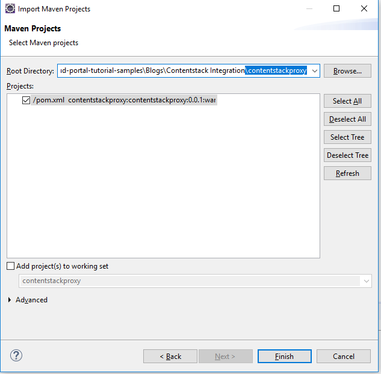

###### Build the Project
- Select the `contentstackproxy` root folder
- Right click and select `Run As > Maven Install`
- Notice that the build log is running in the `Console` view
- Once you receive a **BUILD SUCCESS** message make sure the **contentstackproxy.war** has been created under the **target** folder
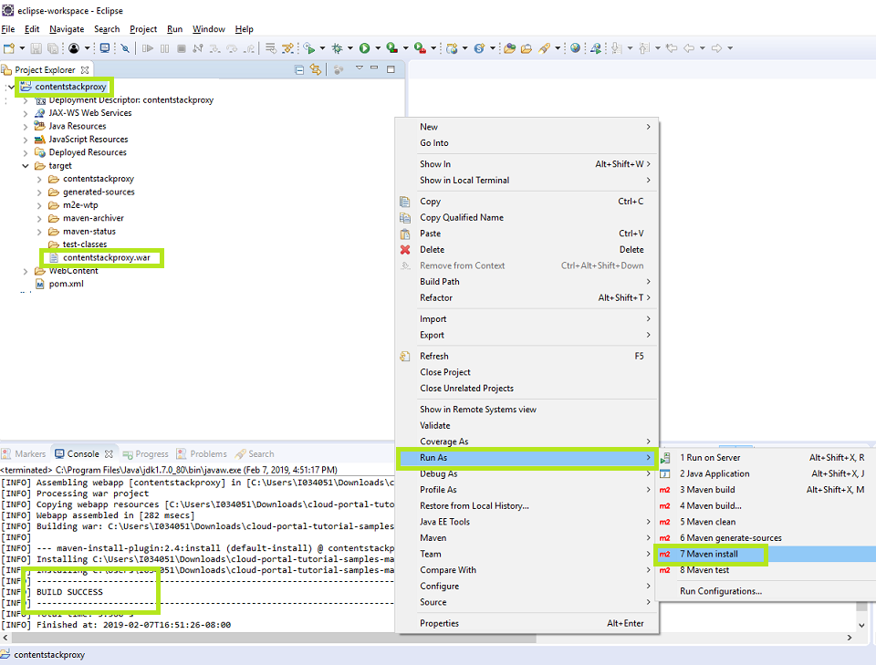

###### Deploy the Project
- Go to you SAP Cloud Platform Cockpit account and navigate to your subaccount.
- Navigate to the page `Applications > Java Applications`.
- Press `Deploy Application`.
- Browse to the file **contentstackproxy.war** and open/upload it.

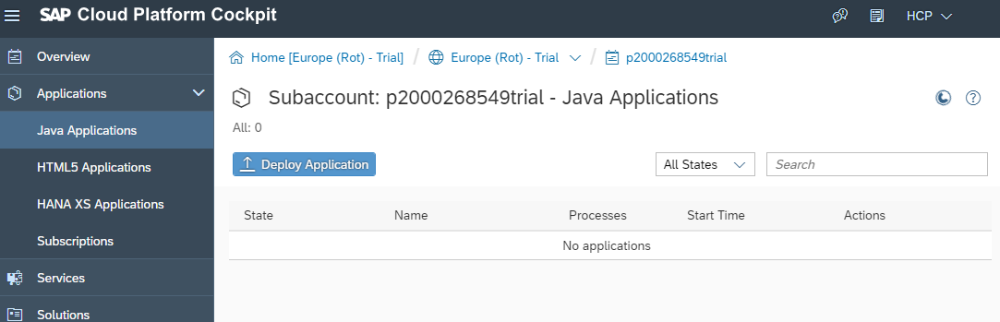

- In the `Additional Parameters` section, select **Java EE 6 Web Profile** as the Runtime Name, and `JRE 7` for the **JVM Version**.
- Press **Deploy**

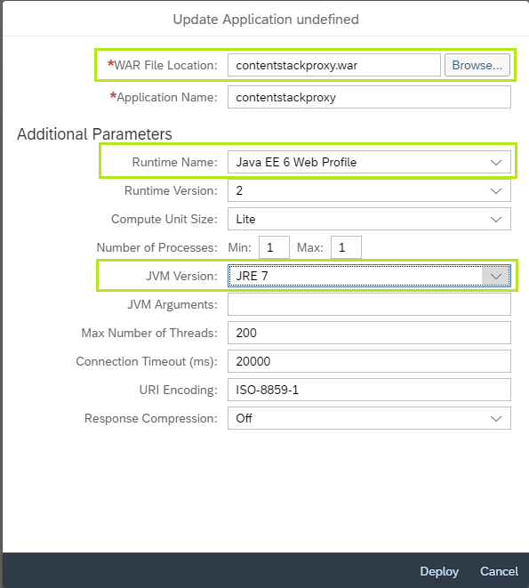
- After successful deployment, press `Start`.
- When the application has successfully started, click on the name/link of the newly deployed and started application in order to show its overview page.
- Copy the first of the URLs shown in the `Application URLs` box and save it (in a notepad) for the next step.
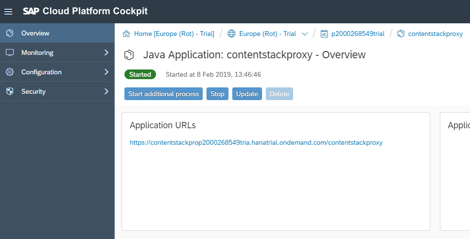

#### Step 6: Create Destinations for Proxy and Backend
SAP Cloud Platform uses destination files as property files for configuring connectivity and authentication method for backend connectivity. The applications deployed on your Cloud Platform account use destination files to perform requests to the designated backend systems. In this step you’ll create two destinations:
1. **contentstack_proxy**  for the frontend (SAPUI5 apps) to connect to the proxy application

- Navigate to `Connectivity > Destinations`.
- Press `New Destination`.
- In the **Destination Configuration** fill in the following data:
  - Name: **contentstack_proxy**
  - Type: [HTTP]
  - URL: _the application URL you copied in the previous step_
  - Proxy Type: [Internet]
  - Authentication: [NoAuthentication]
  - Keep “Use default JDK truststore” checked.
- Press `Save`.
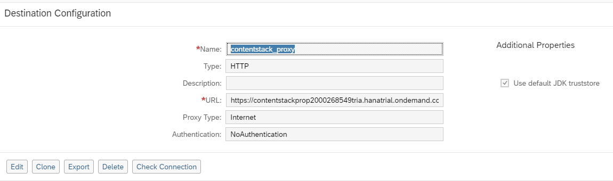

2. **contentstack_backend** for the proxy application to connect to your Contentstack backend environment.

- Go to the Contentstack admin pages (https://app.contentstack.com/).
- Navigate to `Settings > Stack`.
- Copy both the **API key** and the **Access Token** and save them (in a notepad).
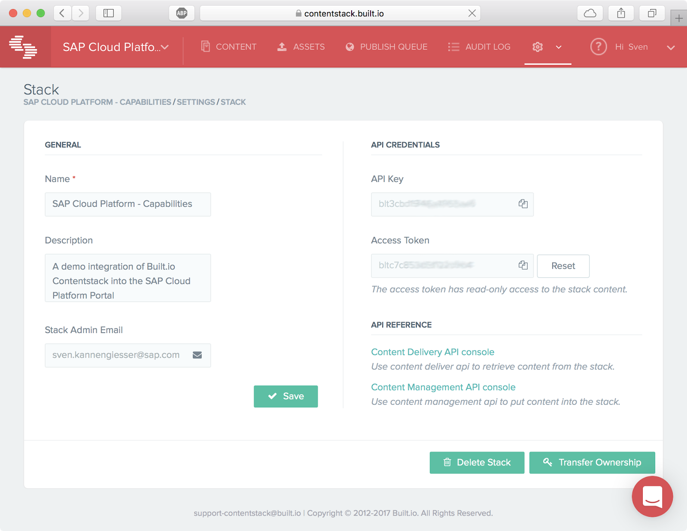
- Go back to your subaccount’s overview page in the SAP Cloud Platform Cockpit.
- Navigate to `Connectivity > Destinations`.
- Press `New Destination`.
- In the “Destination Configuration” fill in the following data:
  - Name: `contentstack_backend`
  - Type: [HTTP]
  - URL: “https://cdn.contentstack.io/v3/"
  - Proxy Type: [Internet]
  - Authentication: [NoAuthentication]
- Add five properties:
  - “API_KEY”: _the API key copied from the stack settings in Contentstack_
  - “AUTHTOKEN”: _the access token copied from the stack settings in Contentstack_
  - “environment": **production**
  - “WebIDEEnabled”: **true**
  - “WebIDEUsage”: “API”
Keep “Use default JDK truststore” checked.
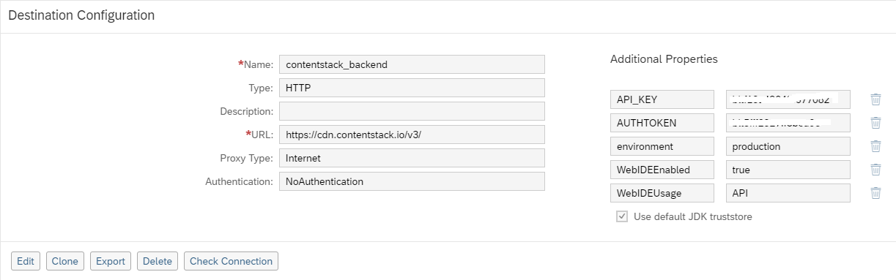

- Press `Save`.

#### Step 7: Develop Widgets in Web IDE
In order to use content managed and provided by Contentstack inside an SAP Cloud Platform Portal site, you need to develop a portal widget to display the content. Each widget is created as a SAPUI5 application and is composed of at least a controller and a view. Depending on the needs it might also have custom controls to render the various content types.

In this How-to Guide we provide three sample widgets which you can import into SAP Web IDE, take as a starting point and adapt to your own needs. They are located under the folder
[Contentstack Integration/portal widgets]():  contentstackfeaturewidget, contentstackherowidget, contentstacklinkswidget.

- To import and deploy each of the 3 widgets, follow the general instructions provided here: [README](../../Blogs/README.md)
- After completing this, your Web IDE workspace should look like this:
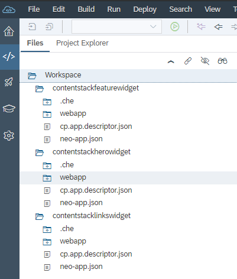

To verify that everything was configured correctly and working run and preview one of the widgets in the Web Web IDE
- Select the **contentstackherowidget**
- Right click and select `Run > Run Configurations`
- Click on the **+** to create a new `SAP Fiori Launchpad Sandbox` run Configuration
- Click `Save and Run`
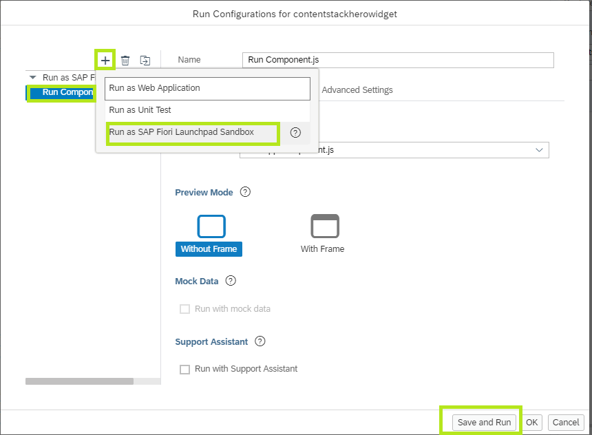

- The widget is opened in the preview environment displaying the HERO content type data rendered according to the control defined in the widget

#### Step 8: Set up a Portal Site
